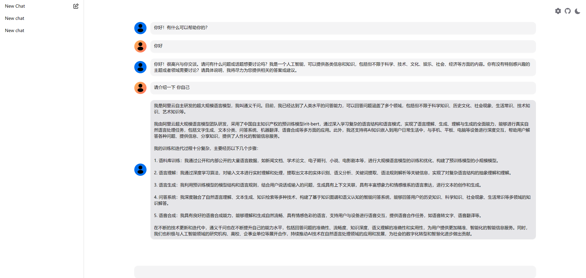

# 与本地LLM聊天


# 简介
提供web界面，通过配置本地LLM接口地址，与本地搭建的LLM聊天

# 说明
> 学习性项目

本地可使用[FastChat](https://github.com/lm-sys/FastChat)启动模型, 方法见FastChat官方文档

## Technologies Used

- [Next.js 13](https://nextjs.org/docs/getting-started)
- [NextUI v2](https://nextui.org/)
- [Tailwind CSS](https://tailwindcss.com/)
- [LangChain](https://js.langchain.com/docs/get_started)

### Install dependencies

```bash
npm install
```

### Run the development server

```bash
npm run dev
```